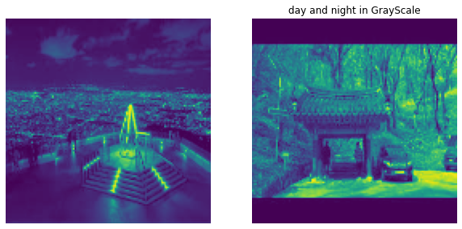
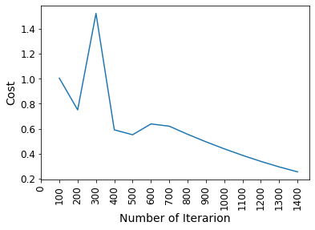
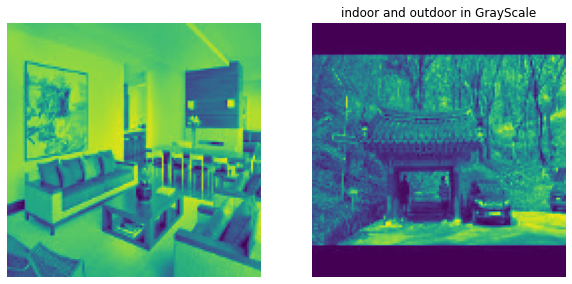
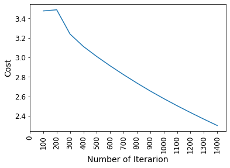

## 조기 종료를 이용한 배치 경사하강법으로 로지스틱 회귀 구현.  <br/>(단, 사이킷런을 사용하지 않음)

우선 필요한 모듈을 임포트한다.


```python
# 파이썬 ≥3.5 필수
import sys
assert sys.version_info >= (3, 5)

# 사이킷런 ≥0.20 필수
import sklearn
assert sklearn.__version__ >= "0.20"

# 공통 모듈 임포트
import numpy as np
import os

# 깔끔한 그래프 출력을 위해
%matplotlib inline
import matplotlib as mpl
import matplotlib.pyplot as plt
mpl.rc('axes', labelsize=14)
mpl.rc('xtick', labelsize=12)
mpl.rc('ytick', labelsize=12)

# 그림을 저장할 위치
PROJECT_ROOT_DIR = "."
CHAPTER_ID = "training_linear_models"
IMAGES_PATH = os.path.join(PROJECT_ROOT_DIR, "images", CHAPTER_ID)
os.makedirs(IMAGES_PATH, exist_ok=True)

def save_fig(fig_id, tight_layout=True, fig_extension="png", resolution=300):
    path = os.path.join(IMAGES_PATH, fig_id + "." + fig_extension)
    print("그림 저장:", fig_id)
    if tight_layout:
        plt.tight_layout()
    plt.savefig(path, format=fig_extension, dpi=resolution)
    
# 어레이 데이터를 csv 파일로 저장하기
def save_data(fileName, arrayName, header=''):
    np.savetxt(fileName, arrayName, delimiter=',', header=header, comments='')
```

**데이터 준비**  
붓꽃 데이터셋의 꽃잎 길이(petal length)와 꽃잎 너비(petal width) 특성을 이용하여  
꽃의 품종이 버지니카인 것과 아닌 것들로 분류한다.

사이킷런에서 제공하는 붓꽃 데이터는 `Bunch` 자료형이다.  
기본적으로 `dict`자료형과 동일하나,  
차이점은 인덱싱을 속성처럼 처리할 수 있다는 것이다.


```python
# 붓꽃 데이터만 불러오기 위해 sklearn 사용
from sklearn import datasets
iris = datasets.load_iris()
```

타겟은 꽃의 품종이다.  
0: 세토사  
1: 버시컬러  
2: 버지니카


```python
iris.target
```


    array([0, 0, 0, 0, 0, 0, 0, 0, 0, 0, 0, 0, 0, 0, 0, 0, 0, 0, 0, 0, 0, 0,
           0, 0, 0, 0, 0, 0, 0, 0, 0, 0, 0, 0, 0, 0, 0, 0, 0, 0, 0, 0, 0, 0,
           0, 0, 0, 0, 0, 0, 1, 1, 1, 1, 1, 1, 1, 1, 1, 1, 1, 1, 1, 1, 1, 1,
           1, 1, 1, 1, 1, 1, 1, 1, 1, 1, 1, 1, 1, 1, 1, 1, 1, 1, 1, 1, 1, 1,
           1, 1, 1, 1, 1, 1, 1, 1, 1, 1, 1, 1, 2, 2, 2, 2, 2, 2, 2, 2, 2, 2,
           2, 2, 2, 2, 2, 2, 2, 2, 2, 2, 2, 2, 2, 2, 2, 2, 2, 2, 2, 2, 2, 2,
           2, 2, 2, 2, 2, 2, 2, 2, 2, 2, 2, 2, 2, 2, 2, 2, 2, 2])


```python
X = iris["data"][:, (2,3)]  # 꽃잎 길이와 너비
y = (iris["target"] == 2).astype(np.int)
```

0번 특성에 편향을 추가한다.


```python
X_with_bias = np.c_[np.ones([len(X), 1]), X]
```

반복해도 같은 결과가 나오게 하기 위해 랜덤 시드를 지정한다.`


```python
np.random.seed(2042)
```

**데이터셋 분할**  
데이터셋을 아래처럼 나눈다.
* 훈련 세트: 60%
* 검증 세트: 20%
* 테스트 세트: 20%


```python
test_ratio = 0.2                                         # 테스트 세트 비율 = 20%
validation_ratio = 0.2                                   # 검증 세트 비율 = 20%
total_size = len(X_with_bias)                            # 전체 데이터셋 크기

test_size = int(total_size * test_ratio)                 # 테스트 세트 크기: 전체의 20%
validation_size = int(total_size * validation_ratio)     # 검증 세트 크기: 전체의 20%
train_size = total_size - test_size - validation_size    # 훈련 세트 크기: 전체의 60%
```

`np.random.permutation()` 함수를 이용하여 인덱스를 무작위로 섞는다.


```python
rnd_indices = np.random.permutation(total_size)
```

훈련, 검증, 테스트세트로 분할된 데이터셋의 인덱스를 섞는다.


```python
X_train = X_with_bias[rnd_indices[:train_size]]
y_train = y[rnd_indices[:train_size]]

X_valid = X_with_bias[rnd_indices[train_size:-test_size]]
y_valid = y[rnd_indices[train_size:-test_size]]

X_test = X_with_bias[rnd_indices[-test_size:]]
y_test = y[rnd_indices[-test_size:]]
```


```python
y_train[:5]
```


    array([0, 0, 1, 0, 0])


**로지스틱 모델 구현**

로지스틱 함수는 시그모이드 함수를 사용한다.

$$
\sigma(t) = \frac{1}{1 + e^{-t}}
$$


```python
def logistic(logits):
    return 1.0 / (1 + np.exp(-logits))
```

가중치를 조정해나가기 위해 세타를 생성한다.

$$
\begin{align*}
\hat y^{(i)} & = \theta^{T}\, \mathbf{x}^{(i)} \\
 & = \theta_0 + \theta_1\, \mathbf{x}_1^{(i)} + \cdots + \theta_n\, \mathbf{x}_n^{(i)}
\end{align*}
$$

여기서 특성이 2개(꽃잎 길이, 너비)이므로 n = 2


```python
n_inputs = X_train.shape[1] #편향과 특성의 갯수
Theta = np.random.randn(n_inputs) #편향과 특성의 갯수만큼 세타값 랜덤초기화
```

로지스틱 회귀의 비용함수는 아래와 같다.

$$
J(\boldsymbol{\theta}) = -\dfrac{1}{m} \sum\limits_{i=1}^{m}{\left[ y^{(i)} log\left(\hat{p}^{(i)}\right) + (1 - y^{(i)}) log\left(1 - \hat{p}^{(i)}\right)\right]}
$$

배치 경사하강법 훈련은 아래 코드를 통해 이루어진다.

- `eta = 0.1`: 학습률
- `n_iterations = 5001` : 에포크 수
- `m = len(X_train)`: 훈련 세트 크기, 즉 훈련 샘플 수
- `epsilon = 1e-7`: $\log$ 값이 항상 계산되도록 더해지는 작은 실수
- `logits`: 모든 샘플에 대한 클래스별 점수, 즉 $\mathbf{X}_{\textit{train}}\, \Theta$
- `Y_proba`: 모든 샘플에 대해 계산된 클래스 별 소속 확률, 즉 $\hat P$


```python
#  배치 경사하강법 구현
eta = 0.1
n_iterations = 5001
m = len(X_train)
epsilon = 1e-7

for iteration in range(n_iterations):     # 5001번 반복 훈련
    logits = X_train.dot(Theta)
    Y_proba = logistic(logits)
   
    if iteration % 500 == 0:
      loss = -np.mean(np.sum((y_train*np.log(Y_proba + epsilon) + (1-y_train)*np.log(1 - Y_proba + epsilon))))
      print(iteration, loss)
    
    error = Y_proba - y_train     # 그레이디언트 계산.
    gradients = 1/m * X_train.T.dot(error)
    
    Theta = Theta - eta * gradients
```

    0 79.35473984499612
    500 27.149524631560638
    1000 21.894389285779454
    1500 19.337773447717066
    2000 17.691444239326714
    2500 16.49516908325313
    3000 15.566000472955372
    3500 14.81327398979558
    4000 14.185530546071133
    4500 13.650751548055764
    5000 13.187653637231028
    


```python
Theta
```


    array([-10.56492618,   0.53611169,   4.82694082])


코드의 세부동작은 다음과 같다.

1. `logits = X_train.dot(Theta)` 에서 행렬연산을 이용해 세타와 x값을 곱하여 `logits` 값을 얻는다.
2. `Y_proba = logistic(logits)` 에 `logits`값을 시그모이드 함수에 넣어 `Y_proba`값을 얻는다.

3. 손실함수 계산을 통해 손실비용 `loss`를 얻는다.

4. y의 확률값과 실제 y값의 차이 `error`를 얻는다.

5. 이를 통해 `gradient` 계산을한다.

6. 세타에 `eta * gradient`만큼의 값을 빼서 세타값 재조정을 한뒤 다음 에포크로 넘어간다.


**검증**  
위에서 얻은 세타값을 이용하여 검증세트로 모델 성능을 판단한다.  
`Y_proba`값이 0.5 이상이라면 1로, 아니면 0으로 입력한다.  
(1이면 버지니카로 분류, 0이면 버지니카가 아닌 것으로 분류)


```python
logits = X_valid.dot(Theta)              
Y_proba = logistic(logits)
y_predict = np.array([])
for i in range(len(Y_proba)):
  if Y_proba[i] >= 0.5:
    y_predict = np.append(y_predict, 1)
  else:
    y_predict = np.append(y_predict, 0)

accuracy_score = np.mean(y_predict == y_valid)  # 정확도 계산
accuracy_score
```


    0.9666666666666667


**모델 규제**  
일반적으로 l2규제를 사용한다.
비용 함수는 아래와 같다.

$$
\begin{align*}
J(\boldsymbol{\theta}) & = \text{MSE}(\boldsymbol{\theta}) + \dfrac{\alpha}{2}\sum\limits_{i=1}^{n}{\theta_i}^2 \\
& = \text{MSE}(\boldsymbol{\theta}) + \dfrac{\alpha}{2}\left (\theta_1^2 + \cdots + \theta_n^2 \right )
\end{align*}
$$


```python
eta = 0.1
n_iterations = 5001
m = len(X_train)
epsilon = 1e-7
alpha = 0.5        # 규제 하이퍼파라미터

Theta = np.random.randn(n_inputs)  # 파라미터 새로 초기화

for iteration in range(n_iterations):
    logits = X_train.dot(Theta)
    Y_proba = logistic(logits)
    
    if iteration % 500 == 0:
        xentropy_loss = -np.mean(np.sum((y_train*np.log(Y_proba + epsilon) + (1-y_train)*np.log(1 - Y_proba + epsilon))))
        l2_loss = 1/2 * np.sum(np.square(Theta[1:]))  # 편향은 규제에서 제외
        loss = xentropy_loss + alpha * l2_loss        # l2 규제가 추가된 손실
        print(iteration, loss)
    
    error = Y_proba - y_train
    l2_loss_gradients = np.r_[np.zeros([1]), alpha * Theta[1:]]   # l2 규제 그레이디언트
    gradients = 1/m * X_train.T.dot(error) + l2_loss_gradients
    
    Theta = Theta - eta * gradients
```

    0 156.73838246234882
    500 36.11974638424874
    1000 34.306068180110614
    1500 34.02211206089248
    2000 33.9713877223945
    2500 33.96211929178583
    3000 33.96041878356459
    3500 33.960106551185575
    4000 33.96004921390298
    4500 33.96003868441417
    5000 33.96003675075696
    

검증 세트를 이용하여 성능을 판단한다.


```python
logits = X_valid.dot(Theta)              
Y_proba = logistic(logits)
y_predict = np.array([])
for i in range(len(Y_proba)):
  if Y_proba[i] >= 0.5:
    y_predict = np.append(y_predict, 1)
  else:
    y_predict = np.append(y_predict, 0)

accuracy_score = np.mean(y_predict == y_valid)  # 정확도 계산
accuracy_score
```


    0.8333333333333334


점수가 조금 낮아졌다.  
이번에는 **조기종료** 기능을 추가한다.  
조기종료는 검증세트에 대한 손실값이 이전 단계보다 커지면 바로 종료되는 기능이다.


```python
eta = 0.1 
n_iterations = 50000
m = len(X_train)
epsilon = 1e-7
alpha = 0.5            # 규제 하이퍼파라미터
best_loss = np.infty   # 최소 손실값 기억 변수

Theta = np.random.randn(n_inputs)  # 파라미터 새로 초기화

for iteration in range(n_iterations):
    # 훈련 및 손실 계산
    logits = X_train.dot(Theta)
    Y_proba = logistic(logits)
    error = Y_proba - y_train
    gradients = 1/m * X_train.T.dot(error) + np.r_[np.zeros([1]), alpha * Theta[1:]]
    Theta = Theta - eta * gradients

    # 검증 세트에 대한 손실 계산
    logits = X_valid.dot(Theta)
    Y_proba = logistic(logits)
    xentropy_loss = -np.mean(np.sum((y_valid*np.log(Y_proba + epsilon) + (1-y_valid)*np.log(1 - Y_proba + epsilon))))
    l2_loss = 1/2 * np.sum(np.square(Theta[1:]))  # 편향은 규제를 하지 않음
    loss = xentropy_loss + alpha * l2_loss
    
    # 500 에포크마다 검증 세트에 대한 손실 출력
    if iteration % 500 == 0:
        print(iteration, loss)
        
    # 에포크마다 최소 손실값 업데이트
    if loss < best_loss:
        best_loss = loss
    else:                                      # 에포크가 줄어들지 않으면 바로 훈련 종료
        print(iteration - 1, best_loss)        # 종료되기 이전 에포크의 손실값 출력
        print(iteration, loss, "조기 종료!")
        break
```

    0 31.861885822665705
    500 12.54052343500867
    1000 11.955093912404864
    1500 11.865469014733975
    2000 11.849523658203214
    2500 11.846612260301496
    3000 11.846078169747395
    3500 11.845980107187028
    4000 11.84596209939774
    4500 11.845958792428052
    5000 11.84595818512936
    5500 11.845958073603672
    6000 11.84595805312284
    6500 11.845958049361695
    7000 11.845958048670989
    7500 11.845958048544144
    8000 11.845958048520849
    8249 11.845958048517861
    8250 11.845958048517861 조기 종료!
    

테스트세트를 이용하여 정확도를 판별한다.


```python
logits = X_test.dot(Theta)
Y_proba = logistic(logits)
y_predict = np.array([])
for i in range(len(Y_proba)):
  if Y_proba[i] >= 0.5:
    y_predict = np.append(y_predict, 1)
  else:
    y_predict = np.append(y_predict, 0)


accuracy_score = np.mean(y_predict == y_test)
accuracy_score
```


    0.9666666666666667


정확도가 높게 측정되었다.  
사이킷런의 로지스틱 모델과 비교해보자.


```python
from sklearn.linear_model import LogisticRegression
log_reg = LogisticRegression(solver="lbfgs", random_state=42)
log_reg.fit(X_train, y_train)
```


    LogisticRegression(random_state=42)


```python
log_reg.score(X_test,y_test)
```


    0.9666666666666667


사이킷런의 로지스틱 모델과 유사한 성능임을 확인할 수 있다.

## 로지스틱 회귀로 다중 클래스 분류 알고리즘 구현 <br/> (역시 사이킷런을 사용하지 않음)

위에서 사이킷런없이 직접 구현한 로지스틱 모델에  
일대다(OvR)방식을 적용하여 붓꽃에 대한  
다중 클래스 분류 알고리즘을 구현할 것이다.  

위에서는 이진 분류로 버지니카인지 아닌지만 구별했다면  
이번에는 각각의 품종으로 분류한다.  

이를 수행하기 위해서 로지스틱 모델을 2개 사용해야 한다.  
setosa를 분류하는 모델, virginica를 분류하는 모델을 만들고,  
1 - (setosa 확률) - (virginica 확률)로 visicolor를 분류한다.

위에서처럼 데이터셋을 분할한다


```python
X = iris["data"][:, (2, 3)]  # 꽃잎 길이, 꽃잎 넓이
y = iris["target"]
y0 = (iris["target"] == 0).astype(np.int) #setosa 판단 모델을 위한 데이터셋
y1 = (iris["target"] == 2).astype(np.int) #virginica 판단 모델을 위한 데이터셋
```


```python
X_with_bias = np.c_[np.ones([len(X), 1]), X] #편향추가
```


```python
np.random.seed(2042) #일정한 결과를 위해 랜덤시드 지정
```


```python
test_ratio = 0.2                                         # 테스트 세트 비율 = 20%
validation_ratio = 0.2                                   # 검증 세트 비율 = 20%
total_size = len(X_with_bias)                            # 전체 데이터셋 크기

test_size = int(total_size * test_ratio)                 # 테스트 세트 크기: 전체의 20%
validation_size = int(total_size * validation_ratio)     # 검증 세트 크기: 전체의 20%
train_size = total_size - test_size - validation_size    # 훈련 세트 크기: 전체의 60%
```


```python
rnd_indices = np.random.permutation(total_size) #데이터 섞기
```

모델 훈련은 각 클래스에 대해 각각 이루어지기 때문에  
각각의 데이터셋을 개별적으로 준비한다.


```python
X_train = X_with_bias[rnd_indices[:train_size]] 
y_train = y[rnd_indices[:train_size]]
y_train0 = y0[rnd_indices[:train_size]] #setosa에 대한 라벨
y_train1 = y1[rnd_indices[:train_size]] #virginica에 대한 라벨

X_valid = X_with_bias[rnd_indices[train_size:-test_size]]
y_valid = y[rnd_indices[train_size:-test_size]]
y_valid0 = y0[rnd_indices[train_size:-test_size]] #setosa에 대한 검증세트 라벨
y_valid1 = y1[rnd_indices[train_size:-test_size]] #virginica에 대한 검증세트 라벨

X_test = X_with_bias[rnd_indices[-test_size:]]
y_test = y[rnd_indices[-test_size:]]
```


```python
n_inputs = X_train.shape[1]
Theta0 = np.random.randn(n_inputs) #setosa 판단모델에 쓰이는 세타값
Theta1 = np.random.randn(n_inputs) #virginica 판단모델에 쓰이는 세타값
```

**setosa 분류 로지스틱 회귀 알고리즘**


```python
eta = 0.1 
n_iterations = 5001
m = len(X_train)
epsilon = 1e-7
alpha = 0.5            # 규제 하이퍼파라미터
best_loss0 = np.infty   # 최소 손실값 기억 변수

Theta0 = np.random.randn(n_inputs)  # 파라미터 새로 초기화

for iteration in range(n_iterations):
    # 훈련 및 손실 계산
    logits0 = X_train.dot(Theta0)
    Y_proba0 = logistic(logits0)
    error = Y_proba0 - y_train0
    gradients0 = 1/m * X_train.T.dot(error) + np.r_[np.zeros([1]), alpha * Theta0[1:]]
    Theta0 = Theta0 - eta * gradients0

    # 검증 세트에 대한 손실 계산
    logits0 = X_valid.dot(Theta0)
    Y_proba0 = logistic(logits0)
    xentropy_loss0 = -np.mean(np.sum((y_valid0*np.log(Y_proba0 + epsilon) + (1-y_valid0)*np.log(1 - Y_proba0 + epsilon))))
    l2_loss0 = 1/2 * np.sum(np.square(Theta0[1:]))
    loss0 = xentropy_loss0 + alpha * l2_loss0
    
    # 500 에포크마다 검증 세트에 대한 손실 출력
    if iteration % 500 == 0:
        print(iteration, loss0)
        
    # 에포크마다 최소 손실값 업데이트
    if loss0 < best_loss0:
        best_loss0 = loss0
    else:                                      # 에포크가 줄어들지 않으면 바로 훈련 종료
        print(iteration - 1, best_loss0)        # 종료되기 이전 에포크의 손실값 출력
        print(iteration, loss0, "조기 종료!")
        break
```

    0 20.540019459712514
    500 7.7445716153439585
    1000 7.672989036271925
    1500 7.668592640555668
    2000 7.668314272027711
    2500 7.668296612120626
    3000 7.668295491624586
    3500 7.668295420530142
    4000 7.668295416019263
    4500 7.66829541573305
    5000 7.668295415714892
    

**virginica 분류 로지스틱 회귀 알고리즘**


```python
eta = 0.1 
n_iterations = 5001
m = len(X_train)
epsilon = 1e-7
alpha = 0.5            # 규제 하이퍼파라미터
best_loss1 = np.infty   # 최소 손실값 기억 변수

Theta1 = np.random.randn(n_inputs)  # 파라미터 새로 초기화

for iteration in range(n_iterations):
    # 훈련 및 손실 계산
    logits1 = X_train.dot(Theta1)
    Y_proba1 = logistic(logits1)
    error = Y_proba1 - y_train1
    gradients1 = 1/m * X_train.T.dot(error) + np.r_[np.zeros([1]), alpha * Theta1[1:]]
    Theta1 = Theta1 - eta * gradients1

    # 검증 세트에 대한 손실 계산
    logits1 = X_valid.dot(Theta1)
    Y_proba1 = logistic(logits1)
    xentropy_loss1 = -np.mean(np.sum((y_valid1*np.log(Y_proba1 + epsilon) + (1-y_valid1)*np.log(1 - Y_proba1 + epsilon))))
    l2_loss1 = 1/2 * np.sum(np.square(Theta1[1:]))
    loss1 = xentropy_loss1 + alpha * l2_loss1
    
    # 500 에포크마다 검증 세트에 대한 손실 출력
    if iteration % 500 == 0:
        print(iteration, loss1)
        
    # 에포크마다 최소 손실값 업데이트
    if loss1 < best_loss1:
        best_loss1 = loss1
    else:                                      # 에포크가 줄어들지 않으면 바로 훈련 종료
        print(iteration - 1, best_loss1)        # 종료되기 이전 에포크의 손실값 출력
        print(iteration, loss1, "조기 종료!")
        break
```

    0 45.3881848638996
    500 12.482904005693056
    1000 11.947222069327108
    1500 11.864096195806564
    2000 11.849273910674974
    2500 11.846566475123907
    3000 11.846069764314985
    3500 11.845978563684064
    4000 11.845961815948371
    4500 11.845958740374874
    5000 11.845958175570193
    

이제 테스트셋이 적용해보자.  
위에서 구한 두 개의 세타값을 이용한다.  

1. setosa일 확률 `setosa_proba`
2. virginica일 확률 `virginica_proba`
3. versicolor일 확률 `1 - setosa_proba - virginica_proba`  

3개 중 가장 높은 점수가 나온 클래스로 분류한다.  
(setosa일 확률이 가장 높으면 setosa로 분류)


```python
logits = X_test.dot(Theta0) #setosa에 대한 확률값 추정  
setosa_proba = logistic(logits)

logits = X_test.dot(Theta1) #virginica에 대한 확률값 추정 
virginica_proba = logistic(logits)

y_predict = np.array([])
for i in range(len(Y_proba0)):
  prob_list = [[setosa_proba[i], 0], [1-setosa_proba[i]-virginica_proba[i], 1], [virginica_proba[i], 2]]
  prob_list.sort(reverse=True) #가장 높은 확률이 가장 앞으로 오게끔 정렬해준다.
  y_predict = np.append(y_predict, prob_list[0][1]) #가장 확률이 높았던 것을 예측값으로 결정한다.
```


```python
accuracy_score = np.mean(y_predict == y_test)
accuracy_score
```


    0.9333333333333333


0.93으로 꽤 좋은 점수가 나왔다.  
이제 사이킷런의 로지스틱 모델과 비교해보자.  

`LogisticRegression`의 파라미터 `solver`의 값을 `newton-cg`로 하면  
로지스틱 회귀 모델이 다중 클래스 분류를 한다.


```python
from sklearn.linear_model import LogisticRegression
multi_log_reg = LogisticRegression(solver='newton-cg', random_state=42).fit(X_train,y_train)

multi_log_reg.score(X_test,y_test)
```


    0.9333333333333333


0.93으로 같은 점수가 나왔다.   
직접 구현한 로지스틱 알고리즘이  
사이킷런의 로지스틱 모델과 같은 성능임을 확인할 수 있다.

## 사진을 낮과 밤으로 분류하는 로지스틱 회귀 모델 구현

우선 이미지를 다운받는다.


```python
from urllib import request
url = "https://docs.google.com/uc?export=download&id=1emB4lSxEzxzEt7_20w2DZ_Dw1sYS1grA"
request.urlretrieve(url,"day_night.zip")
```


    ('day_night.zip', <http.client.HTTPMessage at 0x2ac5a21f1c0>)


zip파일이므로 압축해제를 한다.


```python
import os
import zipfile

local_zip = 'day_night.zip'

zip_ref = zipfile.ZipFile(local_zip, 'r')

zip_ref.extractall()
zip_ref.close()
```

작성에 필요한 모듈을 임포트한다.  
(`pip install onencv_python`은 `opencv`를 설치하기 위해 작성)


```python
pip install opencv-python
```

    Requirement already satisfied: opencv-python in d:\anaconda\lib\site-packages (4.5.2.52)Note: you may need to restart the kernel to use updated packages.
    Requirement already satisfied: numpy>=1.17.3 in d:\anaconda\lib\site-packages (from opencv-python) (1.19.2)
    
    


```python
import numpy as np # linear algebra
import pandas as pd # data processing, CSV file I/O (e.g. pd.read_csv)
import matplotlib.pyplot as plt
import cv2
import os 
from random import shuffle 
from tqdm import tqdm 
from PIL import Image
# Input data files are available in the "../input/" directory.
# For example, running this (by clicking run or pressing Shift+Enter) will list the files in the input directory
import warnings
warnings.filterwarnings('ignore')
import os
# Any results you write to the current directory are saved as output.
```

label과 train, test에 따라 경로를 지정한다.


```python
train_day = "day_night/train/day"
train_night= "day_night/train/night"
test_day= "day_night/test/day"
test_night= "day_night/test/night"
image_size = 128
```

시험삼아 이미지를 낮과 밤 이미지를 불러온다.


```python
Image.open("day_night/train/day/day_120.jpg")
```


    

    


```python
Image.open("day_night/train/night/night_120.jpg")
```


    

    


각각의 사진들은 사이즈가 전부 다르다.  
머신러닝은 사진의 크기에 따라 특성수를 다르게 받아들이기 때문에 이를 조정해주는 작업이 필요하다.  
이를 `resize`라고 한다.


```python
for image in tqdm(os.listdir(train_night)): 
    path = os.path.join(train_night, image)
    img = cv2.imread(path, cv2.IMREAD_GRAYSCALE) 
    img = cv2.resize(img, (image_size, image_size)).flatten()   
    np_img=np.asarray(img)
    
for image2 in tqdm(os.listdir(train_day)): 
    path = os.path.join(train_day, image2)
    img2 = cv2.imread(path, cv2.IMREAD_GRAYSCALE) 
    img2 = cv2.resize(img2, (image_size, image_size)).flatten() 
    np_img2=np.asarray(img2)

plt.figure(figsize=(10,10))
plt.subplot(1, 2, 1)
plt.imshow(np_img.reshape(image_size, image_size))
plt.axis('off')
plt.subplot(1, 2, 2)
plt.imshow(np_img2.reshape(image_size, image_size))
plt.axis('off')
plt.title("day and night in GrayScale")
```

    100%|███████████████████████████████████████████████████████████████████████████████| 400/400 [00:00<00:00, 492.11it/s]
    100%|███████████████████████████████████████████████████████████████████████████████| 400/400 [00:00<00:00, 488.05it/s]
    


    Text(0.5, 1.0, 'day and night in GrayScale')


    

    


낮과 밤 사진을 각각의 경로로 나누었다.  
이를 하나의 훈련세트로 합쳐주는 과정이 필요하다.


```python
def train_data():
    train_data_night = [] 
    train_data_day=[]
    for image1 in tqdm(os.listdir(train_night)): 
        path = os.path.join(train_night, image1)
        img1 = cv2.imread(path, cv2.IMREAD_GRAYSCALE) 
        img1 = cv2.resize(img1, (image_size, image_size))
        train_data_night.append(img1) 
    for image2 in tqdm(os.listdir(train_day)): 
        path = os.path.join(train_day, image2)
        img2 = cv2.imread(path, cv2.IMREAD_GRAYSCALE) 
        img2 = cv2.resize(img2, (image_size, image_size))
        train_data_day.append(img2) 
    
    train_data= np.concatenate((np.asarray(train_data_night),np.asarray(train_data_day)),axis=0)
    return train_data 
```

테스트세트에서도 합쳐준다.


```python
def test_data():
    test_data_night = [] 
    test_data_day=[]
    for image1 in tqdm(os.listdir(test_night)): 
        path = os.path.join(test_night, image1)
        img1 = cv2.imread(path, cv2.IMREAD_GRAYSCALE) 
        img1 = cv2.resize(img1, (image_size, image_size))
        test_data_night.append(img1) 
    for image2 in tqdm(os.listdir(test_day)): 
        path = os.path.join(test_day, image2)
        img2 = cv2.imread(path, cv2.IMREAD_GRAYSCALE) 
        img2 = cv2.resize(img2, (image_size, image_size))
        test_data_day.append(img2) 
    
    test_data= np.concatenate((np.asarray(test_data_night),np.asarray(test_data_day)),axis=0) 
    return test_data 
```

이제 특성과 레이블을 분리하여 저장한다.


```python
train_data = train_data() 
test_data = test_data()
```

    100%|███████████████████████████████████████████████████████████████████████████████| 400/400 [00:00<00:00, 501.34it/s]
    100%|███████████████████████████████████████████████████████████████████████████████| 400/400 [00:00<00:00, 476.33it/s]
    100%|███████████████████████████████████████████████████████████████████████████████| 100/100 [00:00<00:00, 638.64it/s]
    100%|███████████████████████████████████████████████████████████████████████████████| 100/100 [00:00<00:00, 540.59it/s]
    


```python
x_data=np.concatenate((train_data,test_data),axis=0)
x_data = (x_data-np.min(x_data))/(np.max(x_data)-np.min(x_data))
```


```python
z1 = np.zeros(400)
o1 = np.ones(400)
Y_train = np.concatenate((o1, z1), axis=0)
z = np.zeros(100)
o = np.ones(100)
Y_test = np.concatenate((o, z), axis=0)
```


```python
y_data=np.concatenate((Y_train,Y_test),axis=0).reshape(x_data.shape[0],1)
```


```python
print("X shape: " , x_data.shape)
print("Y shape: " , y_data.shape)
```

    X shape:  (1000, 128, 128)
    Y shape:  (1000, 1)
    

사이킷런의 `train_test_split`를 이용하여  
훈련세트와 테스트세트를 분리한다.


```python
from sklearn.model_selection import train_test_split
x_train, x_test, y_train, y_test = train_test_split(x_data, y_data, test_size=0.15, random_state=42)
number_of_train = x_train.shape[0]
number_of_test = x_test.shape[0]
```


```python
x_train_flatten = x_train.reshape(number_of_train,x_train.shape[1]*x_train.shape[2])
x_test_flatten = x_test .reshape(number_of_test,x_test.shape[1]*x_test.shape[2])
print("X train flatten",x_train_flatten.shape)
print("X test flatten",x_test_flatten.shape)
```

    X train flatten (850, 16384)
    X test flatten (150, 16384)
    


```python
x_train = x_train_flatten.T
x_test = x_test_flatten.T
y_test = y_test.T
y_train = y_train.T
day_night_y_test = y_test
print("x train: ",x_train.shape)
print("x test: ",x_test.shape)
print("y train: ",y_train.shape)
print("y test: ",y_test.shape)
```

    x train:  (16384, 850)
    x test:  (16384, 150)
    y train:  (1, 850)
    y test:  (1, 150)
    

데이터 전처리가 완료되었다.  
다음으로 로지스틱 모델을 직접 구현한다.


```python
def initialize_weights_and_bias(dimension):
    w = np.full((dimension,1),0.01)
    b = 0.0
    return w, b

def sigmoid(z):
    y_head = 1/(1+np.exp(-z))
    return y_head

def forward_backward_propagation(w,b,x_train,y_train):
    # forward propagation
    z = np.dot(w.T,x_train) + b
    y_head = sigmoid(z)
    loss = -y_train*np.log(y_head)-(1-y_train)*np.log(1-y_head)
    cost = (np.sum(loss))/x_train.shape[1]
    # backward propagation
    derivative_weight = (np.dot(x_train,((y_head-y_train).T)))/x_train.shape[1]
    derivative_bias = np.sum(y_head-y_train)/x_train.shape[1]
    gradients = {"derivative_weight": derivative_weight,"derivative_bias": derivative_bias}
    return cost,gradients

def update(w, b, x_train, y_train, learning_rate,number_of_iterarion):
    cost_list = []
    cost_list2 = []
    index = []
    
    for i in range(number_of_iterarion):
        
        cost,gradients = forward_backward_propagation(w,b,x_train,y_train)
        cost_list.append(cost)
        
        w = w - learning_rate * gradients["derivative_weight"]
        b = b - learning_rate * gradients["derivative_bias"]
        if i % 100 == 0:
            cost_list2.append(cost)
            index.append(i)
            print ("Cost after iteration %i: %f" %(i, cost))
    
    parameters = {"weight": w,"bias": b}
    plt.plot(index,cost_list2)
    plt.xticks(index,rotation='vertical')
    plt.xlabel("Number of Iterarion")
    plt.ylabel("Cost")
    plt.show()
    return parameters, gradients, cost_list

def predict(w,b,x_test):
    
    z = sigmoid(np.dot(w.T,x_test)+b)
    Y_prediction = np.zeros((1,x_test.shape[1]))

    for i in range(z.shape[1]):
        if z[0,i]<= 0.5:
            Y_prediction[0,i] = 0
        else:
            Y_prediction[0,i] = 1

    return Y_prediction

def logistic_regression(x_train, y_train, x_test, y_test, learning_rate ,  num_iterations):

    dimension =  x_train.shape[0]
    w,b = initialize_weights_and_bias(dimension)

    parameters, gradients, cost_list = update(w, b, x_train, y_train, learning_rate,num_iterations)
    
    y_prediction_test = predict(parameters["weight"],parameters["bias"],x_test)
    y_prediction_train = predict(parameters["weight"],parameters["bias"],x_train)
    
    print("Test Accuracy: {} %".format(round(100 - np.mean(np.abs(y_prediction_test - y_test)) * 100,2)))
    print("Train Accuracy: {} %".format(round(100 - np.mean(np.abs(y_prediction_train - y_train)) * 100,2)))
```

에포크는 1500, 학습률을 0.01로 지정하고 학습을 시작한다.


```python
logistic_regression(x_train, y_train, x_test, y_test,learning_rate = 0.01, num_iterations = 1500)
```

    Cost after iteration 0: nan
    Cost after iteration 100: 1.004060
    Cost after iteration 200: 0.750676
    Cost after iteration 300: 1.521754
    Cost after iteration 400: 0.591185
    Cost after iteration 500: 0.551972
    Cost after iteration 600: 0.638504
    Cost after iteration 700: 0.620415
    Cost after iteration 800: 0.555815
    Cost after iteration 900: 0.495721
    Cost after iteration 1000: 0.439608
    Cost after iteration 1100: 0.387349
    Cost after iteration 1200: 0.339073
    Cost after iteration 1300: 0.295050
    Cost after iteration 1400: 0.255571
    


    

    


    Test Accuracy: 77.33 %
    Train Accuracy: 92.24 %
    

훈련세트는 92%, 테스트세트는 77%가 나왔다.  
테스트세트의 성능이 낮게 측정된 것으로 보아 과대적합이라 볼 수 있다.

사이킷런의 로지스틱 회귀 모델의 성능과 비교해보자.

사이킷런의 LogisticRegression에 넣기 위해 데이터의 형태를 맞춰준다.


```python
x_train.shape
```


    (16384, 850)


```python
y_train.shape
```


    (1, 850)


```python
y_train2 = np.array([])
for i in y_train:
  y_train2 = np.append(y_train2, np.array([i]))
```


```python
y_test2 = np.array([])
for i in y_test:
  y_test2 = np.append(y_test2, np.array([i]))
```


```python
y_train2.shape
```


    (850,)


```python
from sklearn.linear_model import LogisticRegression

clf = LogisticRegression(penalty='none', 
                         tol=0.1, solver='saga',
                         multi_class='multinomial').fit(x_train.T, y_train2)
```


```python
clf.score(x_test.T, y_test2)
```


    0.7733333333333333


```python
pred1 = clf.predict(x_test.T)
```

앞에서 직접 구현한 모델의 정확도: 74%  
사이킷런의 로지스틱 회귀 모델의 정확도: 77%  
둘의 성능은 유사하나 사이런의 로지스틱 모델이 조금 더 좋다.

## 사진을 나과 밤, 실내와 실외로 분류하는 다중 레이블 분류 모델을 두 개의 로지스틱 회귀 모델로 구현

우선 실내, 실외 사진 데이터를 다운로드한다.


```python
from urllib import request
url = "https://docs.google.com/uc?export=download&id=1CPbsXHOxFEAic3YQBxDdTDKEZXkXMdP1"
request.urlretrieve(url,"indoor_outdoor.zip")
```


    ('indoor_outdoor.zip', <http.client.HTTPMessage at 0x2ac69087cd0>)


앞서 낮과 밤 사진을 분류하는 것과 유사하게 진행한다.


```python
import os
import zipfile

local_zip = 'indoor_outdoor.zip'

zip_ref = zipfile.ZipFile(local_zip, 'r')

zip_ref.extractall()
zip_ref.close()
```


```python
train_indoor = "indoor_outdoor/train/indoors"
train_outdoor= "indoor_outdoor/train/outdoors"
test_indoor= "indoor_outdoor/test/indoors"
test_outdoor= "indoor_outdoor/test/outdoors"
image_size = 128
```

다운로드 된 이미지를 한 번 확인해본다.


```python
Image.open("indoor_outdoor/train/indoors/indoors.101.jpg")
```


    

    


```python
Image.open("indoor_outdoor/train/outdoors/outdoors_120.jpg")
```


    

    


역시 사진의 크기가 전부 다르므로  
사진 크기를 조절한다. (`resize`)


```python
for image in tqdm(os.listdir(train_indoor)): 
    path = os.path.join(train_indoor, image)
    img = cv2.imread(path, cv2.IMREAD_GRAYSCALE) 
    img = cv2.resize(img, (image_size, image_size)).flatten()   
    np_img=np.asarray(img)
    
for image2 in tqdm(os.listdir(train_outdoor)): 
    path = os.path.join(train_outdoor, image2)
    img2 = cv2.imread(path, cv2.IMREAD_GRAYSCALE) 
    img2 = cv2.resize(img2, (image_size, image_size)).flatten() 
    np_img2=np.asarray(img2)

plt.figure(figsize=(10,10))
plt.subplot(1, 2, 1)
plt.imshow(np_img.reshape(image_size, image_size))
plt.axis('off')
plt.subplot(1, 2, 2)
plt.imshow(np_img2.reshape(image_size, image_size))
plt.axis('off')
plt.title("indoor and outdoor in GrayScale")
```

    100%|███████████████████████████████████████████████████████████████████████████████| 400/400 [00:00<00:00, 458.76it/s]
    100%|███████████████████████████████████████████████████████████████████████████████| 400/400 [00:00<00:00, 428.87it/s]
    


    Text(0.5, 1.0, 'indoor and outdoor in GrayScale')


    

    


훈련세트와 데이터세트 구성


```python
def train_data():
    train_data_indoor = [] 
    train_data_outdoor=[]
    for image1 in tqdm(os.listdir(train_indoor)): 
        path = os.path.join(train_indoor, image1)
        img1 = cv2.imread(path, cv2.IMREAD_GRAYSCALE) 
        img1 = cv2.resize(img1, (image_size, image_size))
        train_data_indoor.append(img1) 
    for image2 in tqdm(os.listdir(train_outdoor)): 
        path = os.path.join(train_outdoor, image2)
        img2 = cv2.imread(path, cv2.IMREAD_GRAYSCALE) 
        img2 = cv2.resize(img2, (image_size, image_size))
        train_data_outdoor.append(img2) 
    
    train_data= np.concatenate((np.asarray(train_data_indoor),np.asarray(train_data_outdoor)),axis=0)
    return train_data 
```


```python
def test_data():
    test_data_indoor = [] 
    test_data_outdoor=[]
    for image1 in tqdm(os.listdir(test_indoor)): 
        path = os.path.join(test_indoor, image1)
        img1 = cv2.imread(path, cv2.IMREAD_GRAYSCALE) 
        img1 = cv2.resize(img1, (image_size, image_size))
        test_data_indoor.append(img1) 
    for image2 in tqdm(os.listdir(test_outdoor)): 
        path = os.path.join(test_outdoor, image2)
        img2 = cv2.imread(path, cv2.IMREAD_GRAYSCALE) 
        img2 = cv2.resize(img2, (image_size, image_size))
        test_data_outdoor.append(img2) 
    
    test_data= np.concatenate((np.asarray(test_data_indoor),np.asarray(test_data_outdoor)),axis=0) 
    return test_data 
```


```python
train_data = train_data() 
test_data = test_data()
```

    100%|███████████████████████████████████████████████████████████████████████████████| 400/400 [00:00<00:00, 567.45it/s]
    100%|███████████████████████████████████████████████████████████████████████████████| 400/400 [00:01<00:00, 399.87it/s]
    100%|███████████████████████████████████████████████████████████████████████████████| 100/100 [00:00<00:00, 436.66it/s]
    100%|███████████████████████████████████████████████████████████████████████████████| 100/100 [00:00<00:00, 413.44it/s]
    


```python
x_data=np.concatenate((train_data,test_data),axis=0)
x_data = (x_data-np.min(x_data))/(np.max(x_data)-np.min(x_data))
```


```python
z1 = np.zeros(400)
o1 = np.ones(400)
Y_train = np.concatenate((o1, z1), axis=0)
z = np.zeros(100)
o = np.ones(100)
Y_test = np.concatenate((o, z), axis=0)
```


```python
y_data=np.concatenate((Y_train,Y_test),axis=0).reshape(x_data.shape[0],1)
```


```python
print("X shape: " , x_data.shape)
print("Y shape: " , y_data.shape)
```

    X shape:  (1000, 128, 128)
    Y shape:  (1000, 1)
    

사이킷런을 이용하여 훈련세트와 테스트세트를 분리한다.


```python
from sklearn.model_selection import train_test_split
x_train, x_test, y_train, y_test = train_test_split(x_data, y_data, test_size=0.15, random_state=42)
number_of_train = x_train.shape[0]
number_of_test = x_test.shape[0]
```


```python
x_train_flatten = x_train.reshape(number_of_train,x_train.shape[1]*x_train.shape[2])
x_test_flatten = x_test .reshape(number_of_test,x_test.shape[1]*x_test.shape[2])
print("X train flatten",x_train_flatten.shape)
print("X test flatten",x_test_flatten.shape)
```

    X train flatten (850, 16384)
    X test flatten (150, 16384)
    


```python
x_train = x_train_flatten.T
x_test = x_test_flatten.T
y_test = y_test.T
y_train = y_train.T
out_doors_y_test = y_test
print("x train: ",x_train.shape)
print("x test: ",x_test.shape)
print("y train: ",y_train.shape)
print("y test: ",y_test.shape)
```

    x train:  (16384, 850)
    x test:  (16384, 150)
    y train:  (1, 850)
    y test:  (1, 150)
    

로지스틱 모델을 구현한다.


```python
def initialize_weights_and_bias(dimension):
    w = np.full((dimension,1),0.01)
    b = 0.0
    return w, b

def sigmoid(z):
    y_head = 1/(1+np.exp(-z))
    return y_head

def forward_backward_propagation(w,b,x_train,y_train):
    # forward propagation
    z = np.dot(w.T,x_train) + b
    y_head = sigmoid(z)
    loss = -y_train*np.log(y_head)-(1-y_train)*np.log(1-y_head)
    cost = (np.sum(loss))/x_train.shape[1]
    # backward propagation
    derivative_weight = (np.dot(x_train,((y_head-y_train).T)))/x_train.shape[1]
    derivative_bias = np.sum(y_head-y_train)/x_train.shape[1]
    gradients = {"derivative_weight": derivative_weight,"derivative_bias": derivative_bias}
    return cost,gradients

def update(w, b, x_train, y_train, learning_rate,number_of_iterarion):
    cost_list = []
    cost_list2 = []
    index = []
    
    for i in range(number_of_iterarion):
        
        cost,gradients = forward_backward_propagation(w,b,x_train,y_train)
        cost_list.append(cost)
        
        w = w - learning_rate * gradients["derivative_weight"]
        b = b - learning_rate * gradients["derivative_bias"]
        if i % 100 == 0:
            cost_list2.append(cost)
            index.append(i)
            print ("Cost after iteration %i: %f" %(i, cost))
    
    parameters = {"weight": w,"bias": b}
    plt.plot(index,cost_list2)
    plt.xticks(index,rotation='vertical')
    plt.xlabel("Number of Iterarion")
    plt.ylabel("Cost")
    plt.show()
    return parameters, gradients, cost_list

def predict(w,b,x_test):
    
    z = sigmoid(np.dot(w.T,x_test)+b)
    Y_prediction = np.zeros((1,x_test.shape[1]))

    for i in range(z.shape[1]):
        if z[0,i]<= 0.5:
            Y_prediction[0,i] = 0
        else:
            Y_prediction[0,i] = 1

    return Y_prediction

def logistic_regression(x_train, y_train, x_test, y_test, learning_rate ,  num_iterations):

    dimension =  x_train.shape[0]
    w,b = initialize_weights_and_bias(dimension)

    parameters, gradients, cost_list = update(w, b, x_train, y_train, learning_rate,num_iterations)
    
    y_prediction_test = predict(parameters["weight"],parameters["bias"],x_test)
    y_prediction_train = predict(parameters["weight"],parameters["bias"],x_train)
    
    print("Test Accuracy: {} %".format(round(100 - np.mean(np.abs(y_prediction_test - y_test)) * 100,2)))
    print("Train Accuracy: {} %".format(round(100 - np.mean(np.abs(y_prediction_train - y_train)) * 100,2)))
```

에포크 1500, 학습률 0.01로 학습을 시작한다.


```python
logistic_regression(x_train, y_train, x_test, y_test,learning_rate = 0.01, num_iterations = 1500)
```

    Cost after iteration 0: nan
    Cost after iteration 100: 3.477332
    Cost after iteration 200: 3.488631
    Cost after iteration 300: 3.238884
    Cost after iteration 400: 3.111699
    Cost after iteration 500: 3.008554
    Cost after iteration 600: 2.912879
    Cost after iteration 700: 2.822541
    Cost after iteration 800: 2.736323
    Cost after iteration 900: 2.654448
    Cost after iteration 1000: 2.577169
    Cost after iteration 1100: 2.503902
    Cost after iteration 1200: 2.433777
    Cost after iteration 1300: 2.366150
    Cost after iteration 1400: 2.300616
    


    

    


    Test Accuracy: 53.33 %
    Train Accuracy: 64.35 %
    

결과가 매우 좋지 않게 나왔다.  
학습할 데이터의 양이 적은 것이 원인이 될 수 있다.

사이킷런의 로지스틱 모델과 비교해보자.


```python
in_out_y_train = np.array([])
for i in y_train:
  in_out_y_train = np.append(in_out_y_train, np.array([i]))
```


```python
in_out_y_test = np.array([])
for i in y_test:
  in_out_y_test = np.append(in_out_y_test, np.array([i]))
```


```python
from sklearn.linear_model import LogisticRegression

lg2 = LogisticRegression(penalty='none', 
                         tol=0.1, solver='saga',C = 0.5,
                         multi_class='multinomial').fit(x_train.T, in_out_y_train)
```


```python
pred2 = lg2.predict(x_test.T)
```


```python
lg2.score(x_test.T, in_out_y_test)
```


    0.6066666666666667


직접 구현한 것보다는 높게 나왔지만 좋지 않은 수치이다.

이제 낮과 밤 분류하는 모델과 실내외를 분류하는 모델을 합쳐서  
하나의 다중 분류 모델을 구현한다.


```python
multi_label_list = []
for i in range(len(pred1)):
 multi_label_list.append([pred1[i], pred2[i]]) # 낮과밤에 대한 예측결과와 실내실외에 대한 예측결과를 샘플별로 묶어서 리스트에 저장한다.
```


```python
multi_label_pred = np.array(multi_label_list) # 저장된 리스트를 array로 바꾼다.
```


```python
multi_label_test_list = []
for i in range(len(out_doors_y_test)):
 multi_label_test_list.append([day_night_y_test[0][i], out_doors_y_test[0][i]]) # 낮과밤, 실내실외에 대한 정답을 샘플별로 묶어서 리스트에 저장한다.
```


```python
multi_label_y_test = np.array(multi_label_test_list) # 저장된 리스트를 array로 바꿔준다.
```


```python
accuracy_score = np.mean(multi_label_pred == multi_label_y_test)
accuracy_score
```


    0.5233333333333333


정확도 약 52%로 매우 좋지 않은 수치가 나왔다.  
학습을 하기에 데이터의 양과 품질이 부족했던 것으로 생각한다.
